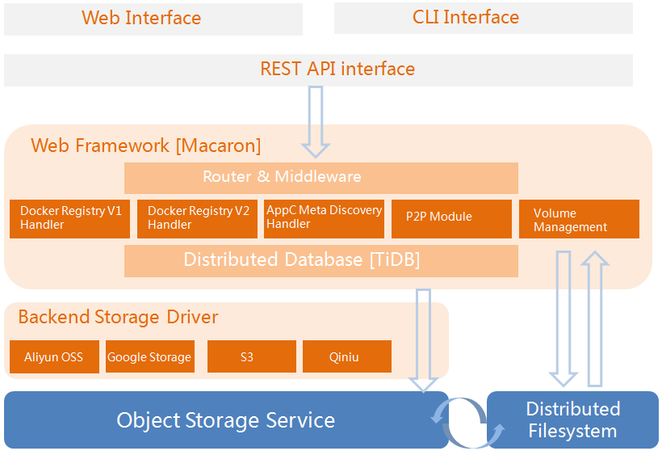

# Dockyard: An image hub for containers


## What is Dockyard
Dockyard is an image hub for docker, rkt or other container engines. Its features include:
- Image storage and meta discovery for popular container runtime such as docker and rkt.
- Image distribution by P2P protocol.
- Public and private repositories for users and organizations.
- Built-in object storage engine and drivers.
- Built-in object storage service.
- Built-in container volume management for runtime with distributed file system.
- Convert image object to distributed file-system for container mount and start directly.
- Container image encryption and verification.

## How it works
The architecture of Dockyard illustrated as below:



Please refer to [design](docs/design.md) for more information.

## Why it matters
Confused by docker registry v1 and v2? Helpless to face different container images(e.g. Docker or rkt)? Too lazy to deal with container image storage problems? Do not worry, Dockyard is coming for you. Please have a cup of tea and wait for this whole thing to blow over.

With dockyard you can manage your container images as freely as you can, you need not to concern with different container engines, and you will not be locked in by docker hub. Just throw these tricky work to Dockyard and focus on your main business.

## Current Status
Please watch this space for updates on the progress.
Dockyard project is under heavy development and is ready for simple use.
- Docker registry V1
- Docker registry V2
- Object storage backend and drivers
- REST API interface
- Rkt Meta Discovery
- P2P modules
- Object storage service

## Future
Work in the future illustrated as below:
- Volume management with distributed file-system.
- Convert between object storage and distributed file-system.
- Web interface and CLI interface.
- Container image encryption and verification.

Please refer to [roadmap](ROADMAP.md) for more information.

## Try it out
Although dockyard is still in development, we encourage you to try out the tool and give feedback. 

### Build
Installation is as simple as:

```bash
# create a 'github.com/containerops' directory in your GOPATH/src
cd github.com/containerops
git clone https://github.com/containerops/dockyard
cd dockyard
make
sudo make install
```

or as involved as:

```bash
go get github.com/containerops/dockyard
cd $GOPATH/src/github.com/containerops/dockyard
go build
```
You can build Dockyard via `make` that depends on Godeps or `go build` that depends on your local package.There may be some problems occured when executing `go get` in chinese network,you'd better use `make` to build it.

### Prerequisites
It is quite easy to use Dockyard, only a little work should be done before starting dockyard service. Take it easy, just follow the instructions as below.

#### Dockyard runtime configuration
Please add a runtime config file named `runtime.conf` under `dockyard/conf` before starting `dockyard` service. Below is a `runtime.conf` example:

```ini
runmode = dev

listenmode = https
httpscertfile = cert/containerops/containerops.crt
httpskeyfile = cert/containerops/containerops.key

[log]
filepath = log/containerops-log

[db]
driver = mysql
uri = localhost:3306
user = root
passwd = 123456
name = dockyard

[dockyard]
path = data
domains = containerops.me
registry = 0.9
distribution = registry/2.0
standalone = true
driver = qiniu

[qiniu]
endpoint = sample.com
bucket = dockyard
accessKeyID = userid
accessKeysecret = userkey
```

* runmode: application run mode must be `dev` or `prod`.
* listenmode: support `http` and `https` protocol.
* httpscertfile: specify user own https certificate file by this parameter.
* httpskeyfile: specify user own https key file by this parameter.
* [log] filepath: specify where Dockyard logs are stored.
* [db] driver: specify `mysql` or `redis` to store image context.
* [db] uri: Dockyard database provider is `mysql` or `redis`,`IP` and `Port` would be specified before database boots.
* [db] user: optionally,specify the user to login and access when `mysql` is used.
* [db] passwd: specify the password to login and access db.
* [db] name: optionally,specify db name when `mysql` is used.
* [db] db: optionally,specify db partition number when `redis` is used.
* [dockyard] path: specify where `Docker` and `Rocket` image files are stored.
* [dockyard] domains: registry server name or IP.
* [dockyard] registry: specify the version of Docker V1 protocol.
* [dockyard] distribution: specify the version of Docker V2 protocol.
* [dockyard] standalone: must be `true` or `false`,specify run mode whether do authorization checks or not.

#### Dockyard middleware configuration
Specify parameters to enable Dockyard notification function. Below is an example of `config.json`:

```ini
{
   "notifications":{
      "name":"notifications",
      "endpoints":[
         {
            "name":"notifyProxy",
            "url":"http://notifyproxy:8088/events",
            "headers":{"Authorization":["Bearer","token"]},
            "timeout":5000,
            "threshold":5,
            "backoff":5000,
            "eventdb":"/tmp",
            "disabled":false
         }
      ]
   }
}
```

#### Nginx configuration
It's a Nginx config example. You can change **client_max_body_size** what limited upload file size. You should copy `containerops.me` keys from `cert/containerops.me` to `/etc/nginx`, then run **Dockyard** with `http` mode and listen on `127.0.0.1:9911`.

```nginx
upstream dockyard_upstream {
  server 127.0.0.1:9911;
}

server {
  listen 80;
  server_name containerops.me;
  rewrite  ^/(.*)$  https://containerops.me/$1  permanent;
}

server {
  listen 443;

  server_name containerops.me;

  access_log /var/log/nginx/containerops-me.log;
  error_log /var/log/nginx/containerops-me-errror.log;

  ssl on;
  ssl_certificate /etc/nginx/containerops.me.crt;
  ssl_certificate_key /etc/nginx/containerops.me.key;

  client_max_body_size 1024m;
  chunked_transfer_encoding on;

  proxy_redirect     off;
  proxy_set_header   X-Real-IP $remote_addr;
  proxy_set_header   X-Forwarded-For $proxy_add_x_forwarded_for;
  proxy_set_header   X-Forwarded-Proto $scheme;
  proxy_set_header   Host $http_host;
  proxy_set_header   X-NginX-Proxy true;
  proxy_set_header   Connection "";
  proxy_http_version 1.1;

  location / {
    proxy_pass         http://dockyard_upstream;
  }
}
```

### Start dockyard service
- Run directly:

```bash
./dockyard web --address 0.0.0.0 --port 80
```

- Run with Nginx:

```bash
./dockyard web --address 127.0.0.1 --port 9911
```

### Enjoy it
Congratulations! Dockyard is ready for you, just enjoy it:-)
- Add **containerops.me** in your `hosts` file like `192.168.1.66 containerops.me` with IP which run `dockyard`.
- Then `push` with `docker push containerops.me/somebody/ubuntu`.
- You could `pull` with `docker pull -a containerops.me/somebody/ubuntu`.
- Work for fun!

## How to involve
If any issues are encountered while using the dockyard project, several avenues are available for support:
<table>
<tr>
	<th align="left">
	Issue Tracker
	</th>
	<td>
	https://github.com/containerops/dockyard/issues
	</td>
</tr>
<tr>
	<th align="left">
	Google Groups
	</th>
	<td>
	https://groups.google.com/forum/#!forum/dockyard-dev
	</td>
</tr>
</table>


## Who should join
- Ones who want to choose a container image hub instead of docker hub.
- Ones who want to ease the burden of container image management.

## Certificate of Origin
By contributing to this project you agree to the Developer Certificate of
Origin (DCO). This document was created by the Linux Kernel community and is a
simple statement that you, as a contributor, have the legal right to make the
contribution. 

```
Developer Certificate of Origin
Version 1.1

Copyright (C) 2004, 2006 The Linux Foundation and its contributors.
660 York Street, Suite 102,
San Francisco, CA 94110 USA

Everyone is permitted to copy and distribute verbatim copies of this
license document, but changing it is not allowed.

Developer's Certificate of Origin 1.1

By making a contribution to this project, I certify that:

(a) The contribution was created in whole or in part by me and I
    have the right to submit it under the open source license
    indicated in the file; or

(b) The contribution is based upon previous work that, to the best
    of my knowledge, is covered under an appropriate open source
    license and I have the right under that license to submit that
    work with modifications, whether created in whole or in part
    by me, under the same open source license (unless I am
    permitted to submit under a different license), as indicated
    in the file; or

(c) The contribution was provided directly to me by some other
    person who certified (a), (b) or (c) and I have not modified
    it.

(d) I understand and agree that this project and the contribution
    are public and that a record of the contribution (including all
    personal information I submit with it, including my sign-off) is
    maintained indefinitely and may be redistributed consistent with
    this project or the open source license(s) involved.
```

## Format of the Commit Message

You just add a line to every git commit message, like this:

    Signed-off-by: Meaglith Ma <maquanyi@huawei.com>

Use your real name (sorry, no pseudonyms or anonymous contributions.)

If you set your `user.name` and `user.email` git configs, you can sign your
commit automatically with `git commit -s`.
