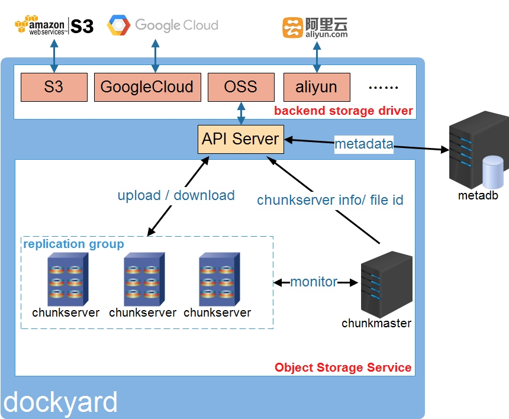

# OSS: A build-in distributed Object Storage Service for dockyard


## Architecture of OSS
OSS=Object Storage Service ,which consists of three parts: APIServer , ChunkMaster and Chunkserver

- APIServer is a stateless proxy service, which provides RESTful API to upload/download and manage image files and get Chunkserver info and file id from chunkmaster. APIServer  choose a suitable chunkserver group to storage image according to Chunkserver information independently.

- ChunkMaster  is a  master node designed to maintain chunkserver information and allocate the file id

- Chunkserver is a storage node for performance and space efficiency. It appends single small image file into large files and maintain file index in memory keeping the IO overhead to a minimum. Normally, a Chunkserver group is consist of 3 Chunkservers and each image allocated to a Chunkserver group stored in all the Chunkservers.

besides, OSS needs the collaboration of a metadb, which stored metadata of images in key-value manner.


## HOW TO USE 

There two modes to use Object Storage Service(OSS), `allinone` and `distribute`

### allinone mode

`allinone` mode means chunkmaster node and chunkserver nodes all deploy on one machine, this mode is mainly for users to try on OSS.

To use `allinone` mode, you should

1. set `osswitch=enable` in `conf/runtime.conf`
```ini
listenmode = https
httpscertfile = cert/containerops/containerops.crt
httpskeyfile = cert/containerops/containerops.key
ossswitch = enable

[oss]
apiport= 80
apihttpsport=443
partsizemb = 4
```

2. set chunkmaster parameters in `oss/chunkmaster.conf`, NOTICE: `servermode` should be `allinone`
```ini
servermode= allinone
masterhost = 10.229.40.140
masterport = 8099
metahost = 10.229.40.121
metaport = 3306
dbuser = root
dbpasswd = wang
db = speedy1
limitcsnum = 1
connpoolcapacity = 200
```

3. set chunkserver node parameters in `oss/chunkserver.conf`
```ini
nodenum=3

[node1]
groupid=1
ip=0.0.0.0
port=9632
listenmode=https
datadir=/root/ossdata
errlogdir=/root/osserrlog
chunknum=2

[node2]
groupid=1
ip=0.0.0.0
port=9633
listenmode=https
datadir=/root/ossdata
errlogdir=/root/osserrlog
chunknum=2

[node3]
groupid=1
ip=0.0.0.0
port=9634
listenmode=https
datadir=/root/ossdata
errlogdir=/root/osserrlog
chunknum=2
```

### distribute mode
`distribute` mode means chunkmaster node and chunkserver nodes deploy on different machine

To use `distribute` mode, you should

1. set `osswitch=enable` in `conf/runtime.conf`
```ini
listenmode = https
httpscertfile = cert/containerops/containerops.crt
httpskeyfile = cert/containerops/containerops.key
ossswitch = enable

[oss]
apiport= 80
apihttpsport=443
partsizemb = 4
```

2. set chunkmaster parameters in `oss/chunkmaster.conf`, NOTICE: `servermode` should be `distribute`
```ini
servermode= distribute
masterhost = 10.229.40.140
masterport = 8099
metahost = 10.229.40.121
metaport = 3306
dbuser = root
dbpasswd = wang
db = speedy1
limitcsnum = 1
connpoolcapacity = 200
```

3. set chunkserver node parameters in `oss/chunkserver.conf`
```ini
nodenum=3

[node1]
groupid=1
ip=10.229.40.120
port=9632
listenmode=https
datadir=/root/ossdata
errlogdir=/root/osserrlog
chunknum=2

[node2]
groupid=1
ip=10.229.40.121
port=9632
listenmode=https
datadir=/root/ossdata
errlogdir=/root/osserrlog
chunknum=2

[node3]
groupid=1
ip=10.229.40.140
port=9632
listenmode=https
datadir=/root/ossdata
errlogdir=/root/osserrlog
chunknum=2

```